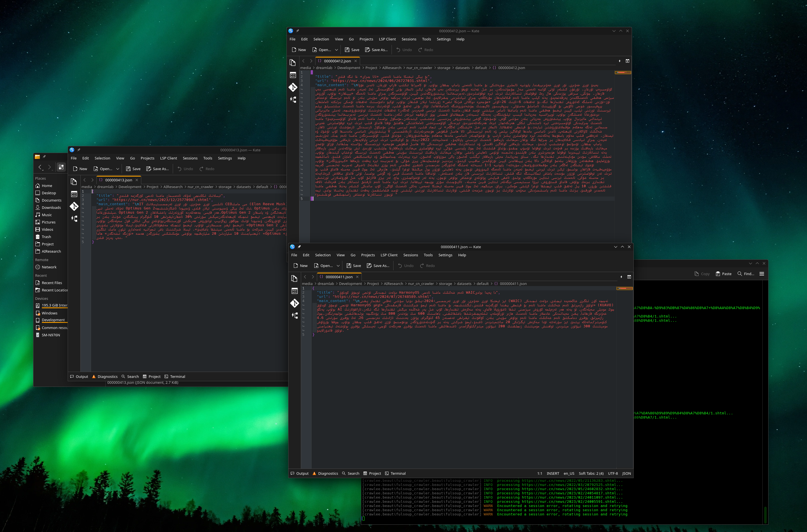
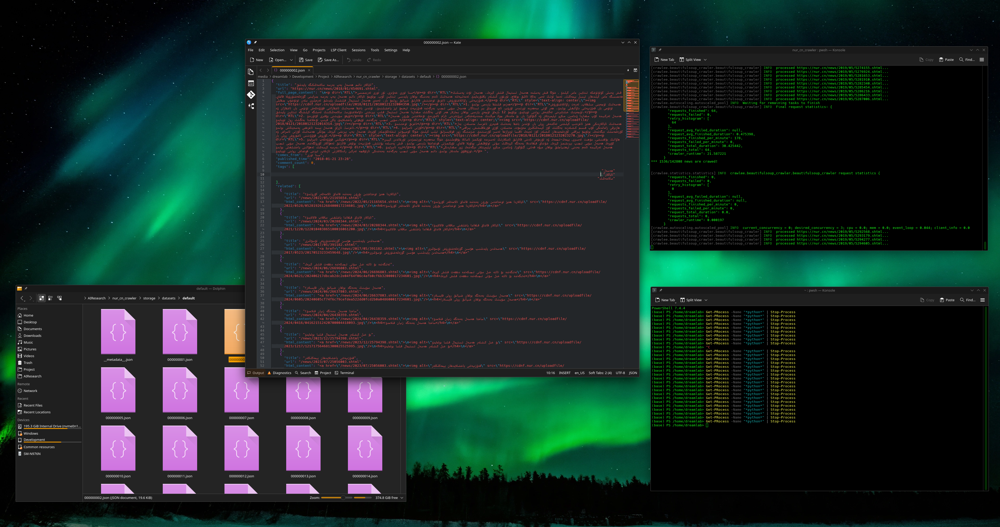

# [nur.cn](https://nur.cn) news crawler

### What is it?

it is uyghur people news website located in China, if you want bunch of Uyghur text datasets to train your machine learning program you can use this tool to collect a lot of text datasets from this news website.





### Features
- supports break point continuation
- can collect all the news category, news links and news content also can avoid news duplication
- `leveldb` is used for storage engine, it is very high performance key value database.
- allough it is slow (approximately only 3 requests per second) but this can effective preventing the server from block your ip address
### How to use?

1. clone this project
2. install crawlee through `uv sync`
3. run program.py file for example: `uv run ./src/program.py`

### what if I want to run some stage of this program?

this crawler program consists several stages:
1. craw_news_category,
2. clean_redundant_category,
3. craw_news_list_from_each_category
4. craw_news_content

so if you want to run only some stage: open `program.py` file and at the end of lines you can see:

```

if __name__ == "__main__":
    asyncio.run(main(
        craw_news_category=True,
        clean_redundant_category=True,
        craw_news_list_from_each_category=True,
        craw_news_content=True
    ))
```

in there you can enable or disable each of parameters, for example if you want only craw news categories and remove redundant (empty news categories) the code should be:

```

if __name__ == "__main__":
    asyncio.run(main(
        craw_news_category=True,                           # <-  THIS LINE IS CHANGED!
        clean_redundant_category=True,                     # <-  THIS LINE IS CHANGED!
        craw_news_list_from_each_category=False,
        craw_news_content=False
    ))

```

and then you want to continue from `craw_news_list_from_each_category` stage then disable 1, 2 stages and enable 3, 4 stages so final code looks like this:

```

if __name__ == "__main__":
    asyncio.run(main(
        craw_news_category=False,
        clean_redundant_category=False,
        craw_news_list_from_each_category=True,            # <-  THIS LINE IS CHANGED!
        craw_news_content=True                             # <-  THIS LINE IS CHANGED!
    ))

```

Staneg 1 and 2 is not support break point continuation but stage 3 and 4 is supports (3 and 4th stage is the biggest time consuming part.)

### Where is crawled data is stored?

it is stored in leveldb in `data` folder in root folder of this program, you can read these leveldb directly.

